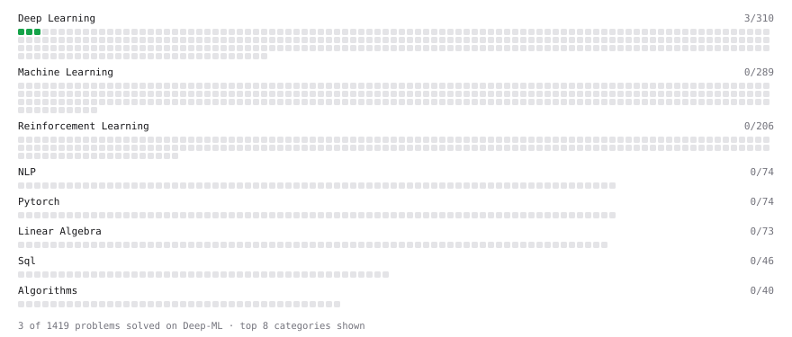

# Deep-ML

My machine learning practice from [Deep-ML](https://www.deep-ml.com). Every solution here was written by hand.

**4** solved · 3 problems · 1 labs · 0 math

[**Browse the interactive portfolio**](https://armanbishal.github.io/deep-ml/) to replay this filling in over time.

## Problems

| | Difficulty | Solved | |
| --- | --- | --- | --- |
| [Sigmoid Activation Function Understanding](https://www.deep-ml.com/problems/22) | easy | 2026-09-17 | [solution](problems/0022-sigmoid-activation-function-understanding) |
| [Single Neuron](https://www.deep-ml.com/problems/24) | easy | 2026-09-17 | [solution](problems/0024-single-neuron) |
| [Softmax Activation Function Implementation ](https://www.deep-ml.com/problems/23) | easy | 2026-09-17 | [solution](problems/0023-softmax-activation-function-implementation) |

## Labs

| | Difficulty | Solved | |
| --- | --- | --- | --- |
| [Train a Linear Regression Model](https://www.deep-ml.com/labs/18) | easy | 2026-09-17 | [solution](labs/0018-train-a-linear-regression-model) |

---

_This file is regenerated by Deep-ML on every push._
